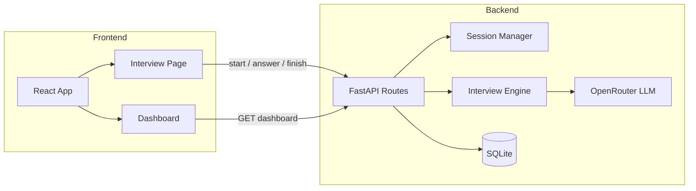

# AI Mock Interview

An AI-powered mock interview platform that simulates real technical interviews, gives instant feedback on your answers, and generates a detailed performance report when you're done. Built with **FastAPI** and **React**.

Practice for roles like .NET Backend Developer in a chat-style interface with a countdown timer, per-answer scoring, and a dashboard to track your progress over time.

---

## Features

- **AI-driven interviews** — Questions and follow-ups are generated by an LLM via [OpenRouter](https://openrouter.ai/), tailored to role, experience level, and current topic.
- **Structured interview flow** — Topic-based plans with progressive difficulty (Easy → Medium → Hard), starting with intro and moving through core concepts like C#, OOP, SOLID, ASP.NET Core, EF, SQL, Docker, and System Design.
- **Instant feedback** — After each answer you receive a score (0–10), strengths, and areas to improve before the next question.
- **Final report** — End the session to get an overall evaluation with technical, communication, and confidence scores, plus strengths, weaknesses, and recommendations.
- **Dashboard** — View total interviews, average score, highest score, and a list of recent sessions stored in SQLite.
- **Timed sessions** — Choose interview duration (10–30 minutes) with a live countdown.

---

## Tech Stack

| Layer      | Technologies |
|-----------|--------------|
| **Backend**  | Python, FastAPI, SQLAlchemy, SQLite, Pydantic, OpenAI SDK (OpenRouter) |
| **Frontend** | React 19, TypeScript, Vite, Tailwind CSS, React Router, Axios |
| **AI**       | OpenRouter API (configurable model) |

---

## Architecture



**How a session works:**

1. User configures name, role, experience, and duration, then starts an interview.
2. Backend creates a session and asks the LLM for the first question (no scoring yet).
3. Each submitted answer is appended to session history; the LLM evaluates the answer and returns feedback + the next question.
4. On finish, the full conversation is sent to the LLM to produce a structured report, which is saved to the database and shown in the UI.

---

## Project Structure

```
mock-interview-project/
├── backend/
│   └── app/
│       ├── main.py                 # FastAPI app entry point
│       ├── routes.py               # REST API endpoints
│       ├── config.py               # Environment config
│       ├── llm.py                  # OpenRouter client
│       ├── session.py              # Interview session model
│       ├── session_manager.py      # In-memory session storage
│       ├── schemas.py              # Pydantic request/response models
│       ├── engine/
│       │   ├── interview_engine.py # Topic & difficulty logic
│       │   └── interview_plan.py   # Role-based interview plans
│       ├── services/
│       │   ├── interview_service.py
│       │   └── report_service.py
│       ├── prompts/
│       │   ├── prompts.py          # Interview system prompts
│       │   └── report_prompts.py   # Report generation prompt
│       ├── parsers/
│       │   └── response_parsers.py # JSON response parsing
│       └── database/
│           ├── database.py         # SQLite setup
│           ├── models.py           # SQLAlchemy models
│           └── repository.py       # Report persistence & dashboard queries
│
└── frontend/
    └── frontend/
        └── src/
            ├── pages/
            │   ├── DashboardPage.tsx
            │   ├── InterviewPage.tsx
            │   └── InterviewReport.tsx
            ├── components/         # Chat, feedback, dashboard UI
            ├── api/                # Axios API clients
            └── types/              # TypeScript interfaces
```

---

## Prerequisites

- **Python** 3.10+
- **Node.js** 18+
- An [OpenRouter](https://openrouter.ai/) API key

---

## Getting Started

### 1. Clone the repository

```bash
git clone https://github.com/<your-username>/mock-interview-project.git
cd mock-interview-project
```

### 2. Backend setup

Create and activate a virtual environment:

```bash
cd backend
python -m venv venv

# Windows
venv\Scripts\activate

# macOS / Linux
source venv/bin/activate
```

Install dependencies:

```bash
pip install fastapi uvicorn sqlalchemy pydantic python-dotenv openai
```

Create a `.env` file in the `backend` directory:

```env
OPENROUTER_API_KEY=your_openrouter_api_key_here
MODEL=openai/gpt-4o-mini
```

> Replace `MODEL` with any model supported by OpenRouter (e.g. `anthropic/claude-3.5-sonnet`, `google/gemini-flash-1.5`).

Start the API server:

```bash
uvicorn app.main:app --reload
```

The backend runs at **http://127.0.0.1:8000**.  
Interactive API docs: **http://127.0.0.1:8000/docs**

### 3. Frontend setup

Open a new terminal:

```bash
cd frontend/frontend
npm install
npm run dev
```

The frontend runs at **http://localhost:5173**

---

## API Endpoints

| Method | Endpoint              | Description |
|--------|-----------------------|-------------|
| `POST` | `/interview/start`    | Start a new interview session |
| `POST` | `/interview/answer`   | Submit an answer and get feedback + next question |
| `POST` | `/interview/finish`   | End the interview and generate a report |
| `GET`  | `/interview/dashboard`| Get summary stats and recent interviews |

### Example: Start interview

**Request**

```json
POST /interview/start
{
  "role": ".Net Backend Developer",
  "experience": "3 Years",
  "username": "John Doe",
  "duration": 10
}
```

**Response**

```json
{
  "session_id": "uuid-here",
  "feedback": {
    "score": 0,
    "strengths": [],
    "improvements": []
  },
  "next_question": "Tell me about yourself and your experience with .NET."
}
```

---

## Interview Plans

Interview topics are defined per role in `backend/app/engine/interview_plan.py`.

Currently, a full plan is configured for:

| Role | Topics |
|------|--------|
| **.Net Backend Developer** | Introduction, C#, OOP, SOLID, Dependency Injection, ASP.NET Core, Entity Framework, SQL, Docker, System Design |

The frontend UI lists additional roles (React, Python, Java, etc.), but those require corresponding plans in `INTERVIEW_PLANS` before they can be used.

---

## Environment Variables

| Variable | Description |
|----------|-------------|
| `OPENROUTER_API_KEY` | Your OpenRouter API key |
| `MODEL` | LLM model identifier (OpenRouter format) |

---

## Screenshots

> Add screenshots of the Dashboard, Interview chat, and Report page here for your GitHub repo.

---

## Roadmap / Ideas

- [ ] Add interview plans for React, Python, Java, and other roles
- [ ] Persist full conversation history in the database
- [ ] Add authentication and user profiles
- [ ] Support voice-based answers
- [ ] Export interview reports as PDF
- [ ] Add `requirements.txt` and Docker Compose for easier setup

---

## License

This project is open source.

---

## Author

Built as a mock interview practice tool. Feel free to fork, extend, and contribute.
